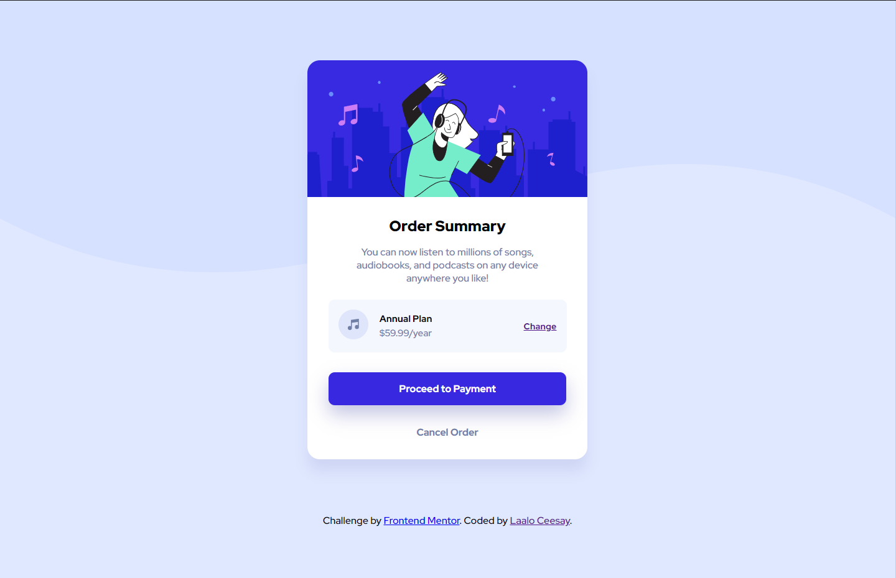
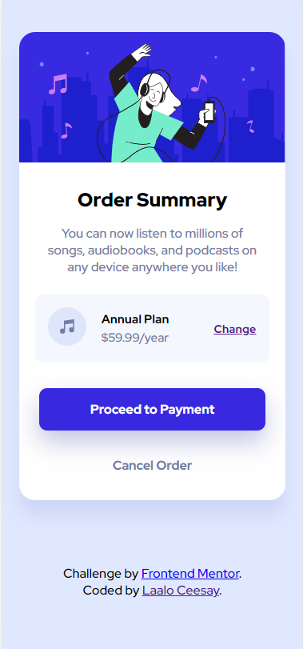

# Frontend Mentor - Order summary card solution

This is a solution to the [Order summary card challenge on Frontend Mentor](https://www.frontendmentor.io/challenges/order-summary-component-QlPmajDUj). Frontend Mentor challenges help you improve your coding skills by building realistic projects. 

## Table of contents

- [Overview](#overview)
  - [The challenge](#the-challenge)
  - [Screenshot](#screenshot)
  - [Links](#links)
- [My process](#my-process)
  - [Built with](#built-with)
  - [What I learned](#what-i-learned)
  - [Continued development](#continued-development)
  - [Useful resources](#useful-resources)
- [Author](#author)

**Note: Delete this note and update the table of contents based on what sections you keep.**

## Overview

### The challenge

Users should be able to:

- See hover states for interactive elements

### Screenshot




### Links

- Live Site URL: [Site](https://61186d8ed7c0cfa6ec2f06c6--relaxed-jackson-9eb910.netlify.app/)

## My process

### Built with

- Semantic HTML5 markup
- [SCSS](https://sass-lang.com/guide) custom properties - for styles
- [Flexbox](https://css-tricks.com/snippets/css/a-guide-to-flexbox/)
- Mobile-first workflow

### What I learned

I learned that you can add title to your images so it will be visible when hovering
and that you should always use one <h1> tag because screen reader users can use keyboard shortcuts to navigate directly to the first <h1>, which, in principle, should allow them to jump directly to the main content of the web page. And more about box-shadows

```css
.wrapper {
  width: 450px;
  border-radius: 20px;
  background-color: white;
  display: flex;
  flex-direction: column;
  justify-content: center;
  align-items: center;
  overflow: hidden;
  box-shadow: 0px 20px 20px rgba($color: #3d3fa1, $alpha: 0.1);
  margin: 0 .8em;
}
```

### Continued development

I'm going to focus more on responsiveness / styles and making easy to read code

### Useful resources

- [level-one heading](https://dequeuniversity.com/rules/axe/4.2/page-has-heading-one?application=axeAPI) - This helped me for unnderstanding more about screen readers. I think this was good thing to learn and i will remember this in future.

## Author

- Website - [Laalo Ceesay](https://www.laaloceesay.com/)
- Frontend Mentor - [@Laaloz](https://www.frontendmentor.io/profile/Laaloz)
